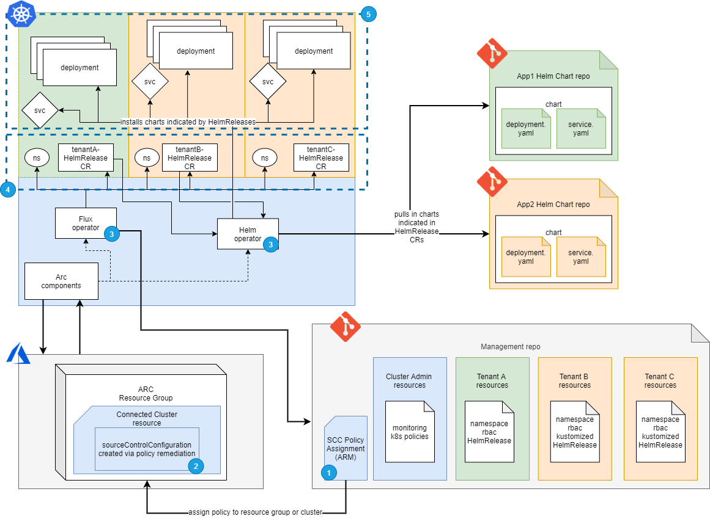
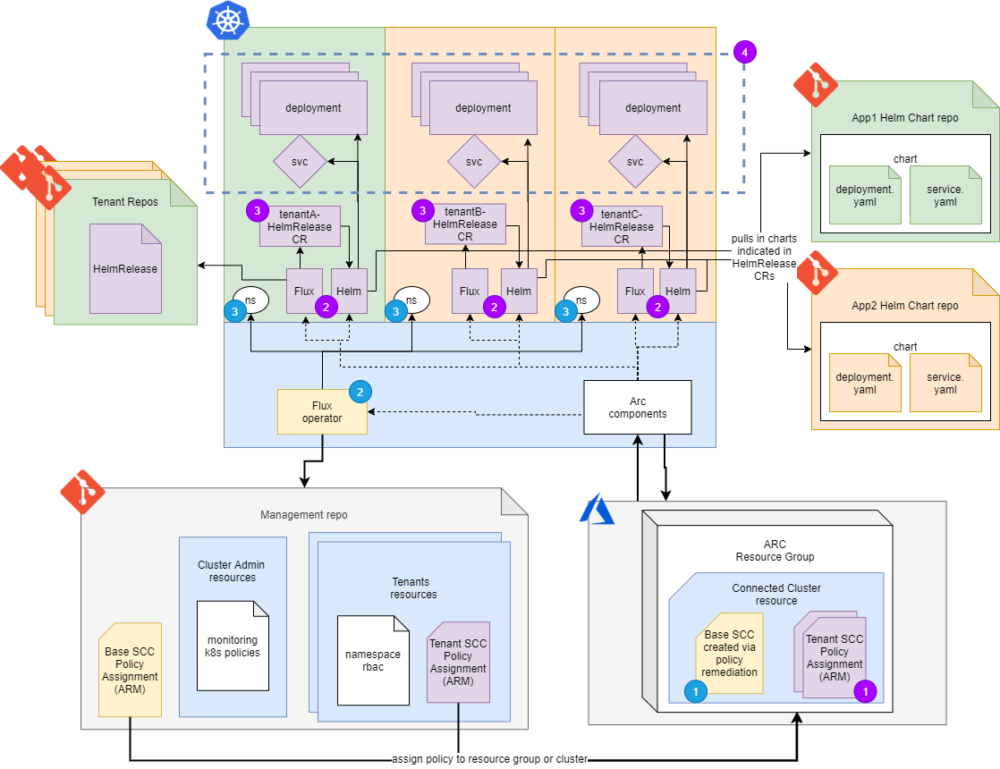

# WIP - Connected Clusters - Soft-Multitenancy Design Doc

## Overview

This document will present possible solutions for implementing soft-multitenancy on Arc connected clusters. Multitenancy describes the ability to serve multiple instances of software and allows for multiple users to work on a single cluster. Hard security boundaries between tenants on a kubernetes cluster are not currently possible, hence _soft_-multitenancy. The approaches in this doc are modeled after https://github.com/fluxcd/multi-tenancy.

Scenarios:

1. Hosting applications from different teams.
1. Hosting the same application but different configurations.

Personas:

* Cluster Operator - managing cluster infra and what is deployed onto it
* Application Operator - maintaining application deployment
* Application Dev - maintaining application source code

## Assumptions

* CI pipeline to build image from source code exists
* Knowledge of [GitOps](https://www.weave.works/technologies/gitops/) practices - git as the source of truth - familiarity with git
  * This knowledge is necessary due to the nature of Arc for K8s, for which the mode of app deployment is through GitOps tooling

## Goals

* Allow for low-friction onboarding of new tenants
* Appropriate isolation of namespaces per tenant

## Technologies

* Git
* Kustomize
* Arc for Kubernetes
* Flux Helm Operator
* Azure Policy / OPA Gatekeeper

## General Approach

* Follow [GitOps](https://www.weave.works/technologies/gitops/) practice and use [Flux Helm Operator](https://github.com/fluxcd/helm-operator-get-started) to manage release configuration and upgrades
* Leverage where applicaple to resuse kubernetes resource definitions
* Use Azure Policy to enforce the deployment and compliance of Flux Helm Operators, as defined by the `sourceControlConfiguration` resource which has the set of properties describing how to setup Flux in the clusters
* Use Azure Policy Add-on for connected clusters to enforce policies with OPA gatekeeper for namespace isolation and resource governance.
* Github Actions to deploy Azure resources (Azure Policy definitions/assignments)

## Implementation 1: Dedicated Flux Instance For Entire Cluster

### Flux's Helm Operator

Helm charts provide a way to package applications to allow for easier deployment and configuration. They can be versioned and live in helm repositories. Flux's Helm Operator deploys helm charts given a HelmRelease which includes the necessary information to retrieve and configure the chart.

Example of what's in a HelmRelease:

```yaml
apiVersion: helm.fluxcd.io/v1
kind: HelmRelease
...
spec:
  releaseName: tenant1-app1
  chart:
    repository: https://kubernetes-charts.storage.googleapis.com/
    name: chart-name
    version: 1.0
  values:
    replicaCount: 3
```

Cluster Operators maintain a git repository with the following structure:

```tree
├── arc
|   └── cluster1-policy-assignment.json (ARM)
├── scripts
|   └── scaffold-tenant.sh
├── base-deployments
|   └── app2
|       ├── app2-base-release.yaml (HelmReleaseCR)
│       └── kustomization.yaml
└── clusters
    └── cluster1
        ├── azure-arc
        |   ├── namespace.yaml
        |   └── policy-addon.yaml (HelmReleaseCR)
        ├── app1
        |   └── tenant1
        |       ├── rbac.yaml
        |       ├── namespace.yaml
        |       └── app1.yaml (HelmReleaseCR)
        └── app2
            ├── tenant2
            |   ├── rbac.yaml
            |   ├── namespace.yaml
            |   ├── app2-patch.yaml
            |   └── kustomization.yaml
            └── tenant3
                ├── rbac.yaml
                ├── namespace.yaml
                ├── app2-patch.yaml
                └── kustomization.yaml
```

* `arc` directory contains Arc specific artifacts: Azure Policy Assignments configured to enforce`sourceControlConfiguration` (SCC) pointing to the respective cluster directory in `clusters`. Using policy assignments instead of direct SCC resources allow for at scale deployments as they can be assigned to entire resource groups
* `scripts` contain any helper scripts; to scaffold tenants for instance.
* `base-deployments` contains any base configurations to be kustomized, allowing for reuse of common configurations (Scenario 2)
* `clusters` directory contains all resources to be deployed onto a cluster, including subdirectories per app/tenant.
* HelmRelease per app/tenant for custom configuration of charts given a helm repository.
  * Note: HelmReleases can also be configured to retrieve charts from git, which presents a possbile upgrade if changes are made to that path in the given git repo.
* Kustomize provides a way to reuse kuberenetes resource definitions, which is helpdul for when HelmReleases are largely the same, but tweaks to the configuration need to be made per tenant.

Example of kustomization.yaml:

```yaml
namespace: tenant2
# relative resources to include in deployment
resources:
  - namespace.yaml
  - role.yaml
# relative path to base deployment
bases:
  - ../../base-deployments/app2/
patchesStrategicMerge:
  - app2-patch.yaml
```

Example of app2-patch.yaml, which configures a different replica count:

```yaml
apiVersion: helm.fluxcd.io/v1
kind: HelmRelease
metadata:
  name: app2
spec:
  values:
    replicaCount: 1
```

Application Operators maintain a git repository with a structure similar to the following:

```tree
├── src
└── charts
    └── app1
        ├── Chart.yaml
        ├── README.md
        ├── templates
        └── values.yaml
```

* Source code may exist in a separate repository
* Flux Helm Operator can be configured to read from this repository, otherwise charts can be published to a helm repository via a release pipeline.
* Dedicated repositories for cluster assets and application assets is not a requirement, though it provides proper separation of concerns.

Here is a visualization of the implementation described below:



Cluster Operator Workflow:

* Cluster operator has onboarded cluster
* Cluster operator creates policy assignment and assigns it to either a resource group or a resource (1)
* **Automated**: Azure policy assignment remediates sourceControlConfiguration resource configured to watch directory with HelmReleases (2)
* **Automated**: Arc's config agent sees new sourceControlConfiguration and creates new Flux and Helm Operator on cluster (3)
* Flux key may need to be added with read permissions on the git repository
* If tenants have the same application with different configurations, then the cluster operator will add a base configuration to `base-deployments`
* Cluster operator uses a script to scaffold a new tenant to submit a PR. For example:
  * a script for scenario 1 would create a directory, HelmRelease, rbac, namespace
  * a script for scenario 2 would create the directory with rbac and namespaces and a patch.yaml
* Cluster operator's PR goes through approval process and is merged into master.
* **Automated**: Flux operator checks for new changes, sees an update, and creates resources including namespace, rbac roles and bindings, and HelmReleases on cluster (4)
* **Automated**: Helm Operator retreives helm chart and deploys resources (5)

Application Operator Workflow:

* Commits change manually or via pipeline to update helm chart
* **Automated**: If configured, Helm Operator will check for changes, see an update, and upgrade releases on cluster (5)
* Pipeline to push chart to helm repository
* If flux Helm Operator is not configured to read from this repository, then a pipeline will commit change to HelmRelease resource in Cluster Operator repository to upgrade applications.

Application Dev Workflow:

* Commits change to source code
* CI triggers new container image
* Release pipeline to update helm chart

| Pros                             | Cons                                  |
| -------------------------------- | ------------------------------------- |
| Single "known good" branch         | With `n` number of configurations, this can lead to complex file structure  |
| Minimize number of flux opertators when pointing to a location dedicated to a cluster | Single point of entry for malicious actors to gain access to tenants | |
| Low-friction onboarding of new tenants |   |

### Without Helm Operator

A similar implementation can still be acheived if applications are not yet packaged into helm charts by leveraging kustomize. Although, for the separation of concerns boundary to be the git repository, the number of flux operators on the cluster will be at least 2, with an additional operator per application.

Cluster operators maintain a git repo to manage tenants:

```tree
├── arc
|   ├── cluster1-base-azure-policy.json (ARM)
|   └── app1-azure-policy.json (ARM)
├── scripts
|   └── scaffold-tenant.sh
└── clusters
    └── cluster1
        ├── tenant1
        |   ├── role.yaml
        |   └── namespace.yaml
        └── tenant2
            ├── role.yaml
            └── namespace.yaml
```

* `arc` assets with:
  * a base policy enforicing SCC pointing to corresponding cluster in `cluster` to deploy tenant specific resources to ensure isolation
  * application specific policy pointing to application operator repository
* Any helper scripts in `scripts` to scaffold and onboard new tenants
* `clusters` contain kubernetes resources to be deployed with resources meant to ensure isolation between tenants,
* Given separated repositories, coordination with the application operator is required to ensure resources are deployed to the correct namespace

Application operators own a git repository with all the manifests and configurations for their app:

```tree
├── deployments
|   └── app1
│       |── base-deployment.yaml
|       |── config-map.yaml
|       └── kustomization.yaml
└── clusters
    └── cluster1
        ├── tenant1
        |   ├── app1-patch.yaml
        |   ├── kubeconfig.yaml
        |   └── kustomization.yaml
        └── tenant2
            ├── app1-patch.yaml
            ├── kubeconfig.yaml
            └── kustomization.yaml
```

* Flux instance has been deployed by the cluster operator to point to this repository (deployed via Arc) points to `cluster` dir as to not deploy rogue manifests in base configuration directory.
* Base configuration for applications in root directory
* Deployed resources in `clusters` directory with each subdirectory coresponding to the configuration per tenant with custom resources.
* `kustomization.yaml` to add patches for custom configurations with appropriate namesapces gathered from cluster operator

Application Operator Workflow:

* Application operator creates manifests for application
* Application operator adds tenant specific configuration
* Application operator Cooridnate with cluster operator to configure assignment to point to correct directory
**Automated**: Once the cluster operator configures your flux instance, the Flux operator checks for new changes and applies any updates to cluster cluster

Cluster Operator Workflow:

* Cluster operator has onboarded cluster
* Cluster operator creates base policy pointing to this repo.
* **Automated**: Flux Operators are deployed to cluster via Azure Policy remediation of sourceControlConfiguration resource
* Cluster operator coordinated with Applicaton Operator to configure tenant and policy assignment
* **Automated**: Flux operator picks up change and creates resources including namespace, rbac roles and bindings.

Application Dev Workflow:

* Commits change to source code
* Build pipeline triggers new container image
* Release pipeline to update manifests in Application Operator repo

Challenges:

* Difficult to manage configuration. With `n` number of resources being described, and ability to patch each resource allows for complex configurations that can easily drift and become hard to manage

## Implementation 2: Dedicated Flux Instance Per Tenant

The first implementation provides a single point of entry for attackers since a single flux instance has access and control over many tenants. The alternative to this is to dedicate a flux instance per tenant.

Cluster Operator Repo:

```tree
└── clusters
    └── cluster1
        ├── base-scc-cluster1-policy-assignment.json (ARM)
        ├── tenant1
        |   ├── rbac.yaml
        |   ├── namespace.yaml
        |   └── tenant1-policy-assignment.json (ARM)
        └── tenant2
            ├── rbac.yaml
            ├── namespace.yaml
            └── tenant2-policy-assignment.json (ARM)
```

Tenant Repo managed by Cluster Operator:

```tree
└── manifests
    └── app1.yaml (HelmReleaseCR)
```

Application operator repo is the same as described above in Flux Helm Operator section

* Cluster Operator repo contains ARM definitions of policies that point to a tenant's repo
* Tenant repo has the manifests that the flux operator will deploy. The flux operator will have at least read permissions to this repo
* Application operator repo contains the chart and/or source code for the application.



* Workflow is similar to the first implementation, the difference is instead of managing directories per tenant, the Cluster Operator will need to manage a repo per tenant:
  * Cluster Operator creates a policy assignments, one configured to look at cluster management repo and one configured for each tenant repo (1)
  * Azure Policy will perform remediations to create SCC for the respective connected cluster, which creates the flux operators (2)
  * The flux operators will then create resources based on their git repositories (3)
  * The helm operators will then create resources based on the HelmReleases (4)

Challenges:

* Increased number of repos to manage
* Increased number of operator keys to manage
* Increased number of operator keys to manage
* Automated upgrades to tenants can be handled by Flux Helm Operator if the Charts repository is maintained such that some branch, `master` for instance, is regarded as truth for deployed instances of that chart.

## Namespace Isolation & Security

In either approach, the following policies should be included in the deployment per tenant to isolate the namespaces:

OPA Gatekeeper Policies:

* No privileged containers
* Whitelisted images only
* Ensure containers listen only on allowed ports
* Use security context to set/limit user and group IDs
* Disallow hostPath mounts
* Ensure the use of SecComp and AppArmor profiles

Network Policies:

* Default deny all per namespace
* Allow ingress/egress to only what's necessary (depends on the workload)

## Secret Management

There are multiple ways to manage secrets within a K8s Multi-tenant Cluster.

1. [Secrets Store CSI Driver](https://github.com/kubernetes-sigs/secrets-store-csi-driver) - By combining this CSI Driver with a Provider that accesses a given secrets storage solution, secrets can be chosen to be written to each pod in memory and also synced as K8s secrets. This CSI Driver is cloud agonistic and can be a choice for on Prem Clusters. In a Multi-tenant scenario, you can leverage your tenants to be authenticated/authorized to specific storage solutions  that are needed for their own tenant namespace, while blocking unnecessary tenants from accessing those secrets.

    * Current Supported Providers
      * [Azure Key Vault Provider](https://github.com/Azure/secrets-store-csi-driver-provider-azure)
      * [Hashicorp Vault Provider](https://github.com/hashicorp/secrets-store-csi-driver-provider-vault)
    * Pros
      * Supported by Open Source and by K8s Sigs
      * Cloud Agnostic - Able to use this solution on Prem, and in any cloud
      * Use of multiple secrets storage solutions such as Hashicorp Vault and Azure Key Vault
      * Choice of syncing secrets to K8s secrets.
      * Windows Container support for K8s 1.18+
      * Single Referenceable Secret Provider Class Resource that can be used across multiple deployments
    * Cons
      * Lack of Windows Container Support for K8s < 1.18
      * AAD Pod Identity is not a viable solution for an On-Prem Cluster. AAD Pod Identiy intercepts traffic to Azure Instance Metadata which is only possible while on Azure.
      * For Azure Service Principal Authorization / Authentication to Azure Key Vault, manual maintenance of SP credentials with K8s secrets increases security risk by having SP credentials written to disk (stored in etcd)

2. [FlexVolume](https://kubernetes.io/docs/concepts/storage/volumes/#flexVolume)

    Flex Volume Integerations:

    1. [Azure Key Vault FlexVol](https://github.com/Azure/kubernetes-keyvault-flexvol)

        **DEPRECATED For K8s Clusters 1.16+**

3. [Akvk8s](https://akv2k8s.io/) - 3rd party tool that allows for environment variable injection into containers, may introduce challenges of observability as the wraps the running process inside a different process.

## Application Upgrades

There are a couple ways to configure automated upgrades with Flux:

1. Image filtering - allows Flux to commit change back into git repository to update images based on filtering of container registry. The challenge here is when there are multiple flux instances watching the same repository, which potentially introduces a race condition or multiple commits back into the repository. If there is a dedicated repo per tenant, this is not a problem.

1. Git repositories for Helm Charts - pointing HelmReleases to a git repository will allow flux to maintain the chart's source of truth and any updates to the given path will result in upgraded helm releases. Depending on the scenario, this may work, but often even if the repository holds the most up-to-date version of a chart, that doesn't necessarily mean instances should be updated. Also, since chart repos are typically managed by Application Operators, this can make it difficult for Cluster operators to know when upgrades occur. There are approaches to consider:

    * Dedicating a whole repository or branch on the helm chart's git repository for automatic upgrades.
    * The release pipeline for the chart is configured to also do a commit to the Cluster Operators repo with HelmReleases

## Risks & Mitigations

* Soft multitenancy requires careful considerations in regards to security. Namespaces are not security boundaries, and therefore Azure Policy and gatekeeper will be leveraged to enforce necessary isolation.
* With a single flux intance being shared accross tenants, this present another point of concern in regards to isolation. If the operator is somehow compromised to point to other tenant's directory, data can be potentially maliciously accessed. A mitigation around this is to lock down the flux operator with RBAC or to have a flux operator and dedicated repository per tenant.
* Azure Policy does not enforce compliance of `sourceControlConfiguration` beyond name or existence of resource. [Issue 68](https://github.com/Azure/azure-arc-kubernetes-preview/issues/68)
* Stability of Helm-Opertor is unknown. There seems to be quite a few open issues so we'll need to track these and keep this in mind as we test. Note: using the helm operator is in the arc for k8s [documentation](https://github.com/Azure/azure-arc-kubernetes-preview/blob/master/docs/use-gitops-with-helm.md)

## Open Questions

* How to secure secrets and connection strings? Keyvault will work well for things in Azure but what about on prem or another cloud?
* Will need to find out which policies are built-in and which need to be built.
* If each tenant requires specific infrastructure, how do we solve this? Investigate [Crossplane](http://crossplane.io/) or [Azure Service Operator](https://github.com/Azure/azure-service-operator)

## Additional References

* [FluxCD Docs](https://docs.fluxcd.io/en/1.18.0/)
* [FluxCD Helm Operator Docs](https://docs.fluxcd.io/projects/helm-operator/en/latest/index.html)
* [Kubectl Kustomize Ref](https://kubectl.docs.kubernetes.io/pages/app_management/introduction.html)